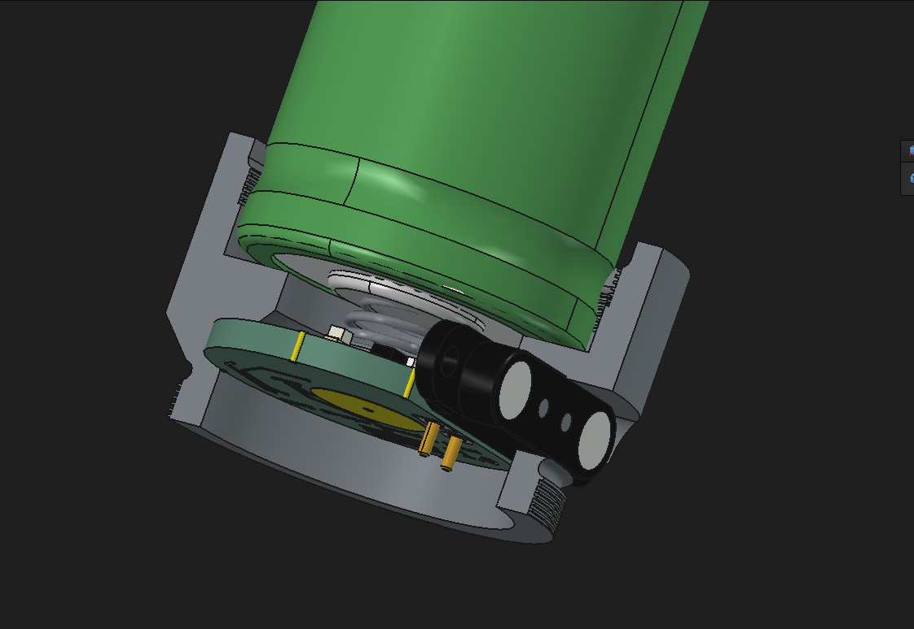

# D4v2Charger

A work-in-progress proof of concept for adding built-in USB-C charging to the
[Emisar D4v2](https://intl-outdoor.com/emisar-d4v2-high-power-led-flashlight.html) flashlight, using a
pogo-pin connector in place of removing the cell to charge it externally.

The charger PCB is a disc that sits sandwiched between the flashlight body
tube and the head, in the same joint where they normally screw together. A
spring contact on the board presses against the cell's positive terminal,
while the pogo-pin connector protrudes to the side to bring in USB-C power
through the body wall.

*Cutaway render: cell (green) above, charger PCB sandwiched at the
body/head joint below, with the spring contact touching the cell's positive
terminal and the pogo-pin connector (black) sticking out to the side.*

## Status

Early prototype / proof of concept. Nothing here has been validated in a
final build yet — expect rough edges, and treat all files as subject to
change.

## How it works

- A small ring-shaped PCB is sandwiched between the flashlight body and
  head, and charges the cell via a
  [TI BQ25185](https://www.ti.com/product/BQ25185) single-cell Li-ion linear
  charger (with integrated power path).
- A spring contact on the board makes the positive connection to the cell,
  so no wiring or modification of the cell itself is needed.
- Power comes in through a pair of spring-loaded pogo pins rather than a
  connector mounted directly on the PCB, so no permanent cutout is needed
  for a USB-C receptacle on the board itself.
- A custom pogo-pin connector part and a modified flashlight body/case were
  designed to accommodate the charging contacts and let the PCB sandwich
  fit at the body/head joint.

## Repo contents

- `pcb/` — KiCad project for the charger board
  - `D4v2Charger.kicad_pro` / `.kicad_sch` / `.kicad_pcb` — schematic and PCB layout
  - `D4v2Charger.step` — 3D export of the finished board
  - `PogoPinConnector/` — FreeCAD model and STEP export of the pogo-pin connector
  - `D4v2Charger-backups/` — automatic KiCad backups (safe to ignore)
- `case/` — FreeCAD model of the modified flashlight body/case to fit the
  charging hardware

## Tools used

- [KiCad](https://www.kicad.org/) for schematic capture and PCB layout
- [FreeCAD](https://www.freecad.org/) for mechanical/case design

## Disclaimer

This is a hobbyist mod to a battery-powered lighting device. Modifying
charging circuitry and battery contacts carries fire/safety risk if done
incorrectly. Use at your own risk.

## License

Licensed under the [CERN Open Hardware Licence Version 2 - Strongly
Reciprocal](LICENSE) (CERN-OHL-S-2.0).
